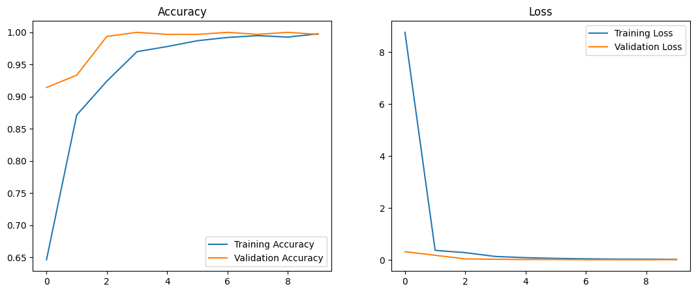
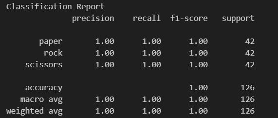
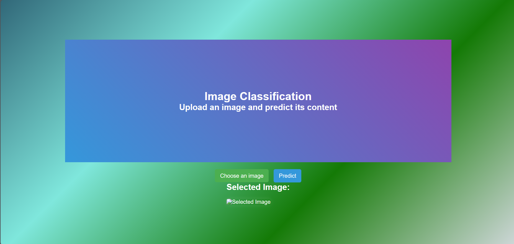
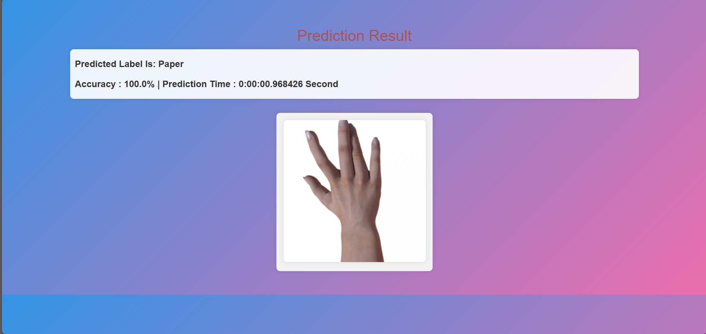

# UAP

## Overview Project

> *NOTE!* Project ini bertujuan untuk mengembangkan model machine learning untuk mengenali citra tangan dalam permainan batu-gunting-kertas (Rock-Paper-Scissors/RPS). Model ini dapat digunakan untuk membuat aplikasi atau game yang memanfaatkan pengenalan gestur tangan.

#### Ketentuan Project
1. Peserta praktikum diminta untuk melakukan pengembangan AI Web Deployment berdasarkan
modul sebelumnya. Jenis data yang dapat dipilih meliputi:
a. Data Citra
b. Data Tabular
c. Data Teks
2. Dataset yang digunakan merupakan dataset yang telah diaplikasikan pada modul-modul sebelumnya.
3. Praktikan diminta untuk memperkaya pengembangan AI Web sebelumnya yang telah di-deploy
dengan kreativitas individu masing-masing. Upaya kreatifitas dapat mencakup peningkatan estetika
tampilan, detail informasi AI Web, peningkatan akurasi model, atau peningkatan aspek lainnya
4. Lakukan deploy model yang telah disimpan ke dalam bentuk web basis. Pilihan library seperti Flask,
Tensorflow-js, atau teknologi lainnya dapat disesuaikan dengan tingkat kemampuan peserta.
5. Setelah model berhasil di-deploy dalam bentuk web dan berjalan dengan baik, peserta diminta untuk
membuat repository GitHub. Selanjutnya, lakukan commit terhadap keseluruhan project, dan
buatlah README.md yang memuat laporan hasil pengembangan proyek. Contoh README.md yang
baik dapat dilihat pada [link berikut](https://github.com/muhfadh/Tugas_Praktikum_ML_A_297-233) 
6. Setelah seluruh tahapan selesai, peserta diminta untuk mengumpulkan link GitHub beserta demo
kepada asisten yang telah ditentukan.

## Dataset
### Pre-Processing dataset
Pada tahap ini meliputi tahap-tahap berikut:
1. Ekstraksi Dataset:
Mengunduh dan mengekstrak dataset RPS dalam format zip.

2. Pembagian Dataset:
Memisahkan dataset menjadi set pelatihan, validasi, dan pengujian menggunakan proporsi 70:25:5.

3. Augmentasi Data:
Menggunakan augmentasi data pada set pelatihan untuk meningkatkan variasi dan mencegah overfitting.
Augmentasi mencakup zoom range sebesar 20%, rotasi hingga 20 derajat, dan flip horizontal.

4. Normalisasi Citra:
Merescale nilai pixel citra agar berada dalam rentang 0 hingga 1.

> *NOTE!* Dataset dapat dilihat pada [link berikut](https://drive.google.com/file/d/1X9jFokn9AXMMVTmlBQ7XZpBsLKVFnp-d/view?usp=drive_link) 

## Model Machine Learning
### Deskripsi Arsitektur Model MobileNetv2
MobileNetV2 adalah arsitektur neural network yang dirancang khusus untuk aplikasi mobile dan perangkat dengan sumber daya terbatas. Berikut adalah komponen-komponen utama dari model ini:

##### MobileNetV2 Base Model
1. Menggunakan arsitektur MobileNetV2 sebagai bagian dasar model.
2. Arsitektur ini terkenal karena efisiensinya dalam mengekstraksi fitur dengan jumlah parameter yang lebih sedikit.

##### Transfer Learning
1. Menggunakan bobot yang telah dilatih dari model MobileNetV2 pada dataset "imagenet".
2. Proses transfer learning membantu model memahami fitur-fitur umum dari dataset "imagenet" dan meningkatkan kinerja pada tugas pengenalan gestur RPS.

##### Fully Connected Layer
1. Menambahkan lapisan-lapisan fully connected di bagian atas base model MobileNetV2.
2. Lapisan ini bertujuan untuk mengkompres fitur yang diekstraksi agar sesuai dengan tugas pengenalan tangan dalam permainan RPS.

##### Regularization
1. Menggunakan dropout dengan tingkat dropout sebesar 20% untuk mencegah overfitting selama pelatihan.

##### Softmax Activation
1. Menggunakan fungsi aktivasi softmax pada lapisan output untuk menghasilkan distribusi probabilitas dari tiga kelas (kertas, batu, gunting).

### Keuntungan dan Kekurangan Arsitektur Model
Keuntungan:
1. Efisiensi dan Keringanan
   MobileNetV2 dirancang khusus untuk aplikasi mobile dan perangkat dengan sumber daya terbatas, membuatnya cocok untuk implementasi di lingkungan terbatas.
2. Kecepatan Inferensi Tinggi
   Dikenal karena kecepatan inferensi yang tinggi, memungkinkan penggunaan model dalam aplikasi real-time.
3. Transfer Learning
   Mampu memanfaatkan transfer learning dari dataset "imagenet" untuk meningkatkan kemampuan model dalam mengenali fitur-fitur umum.
   
Kekurangan:
1. Kurangnya Kompleksitas
   Meskipun efisien, MobileNetV2 mungkin kurang kompleks dibandingkan dengan beberapa arsitektur lainnya, sehingga dapat memiliki keterbatasan dalam menangani dataset yang     sangat kompleks.
2. Potensial Kehilangan Informasi
   Proses transfer learning mungkin menyebabkan kehilangan informasi yang spesifik untuk tugas pengenalan tangan RPS, terutama jika dataset "imagenet" memiliki     
   karakteristik yang sangat berbeda.
3. Keterbatasan untuk Tugas Khusus
   MobileNetV2 dirancang untuk tugas klasifikasi gambar umum, sehingga mungkin tidak seoptimal model yang dikhususkan untuk tugas pengenalan tangan RPS.

### Evaluasi Model
#### Plotting : 

#### Confusion Matrix :

## Deploy Website
> *NOTE!* Model ini telah diimplementasikan sebagai layanan web menggunakan Flask. Pengguna dapat mengaksesnya melalui antarmuka web sederhana untuk menguji model dengan citra dari input pengguna.

#### Antarmuka Website

#### Testing

## Pengembangan Project
#### Validasi Cross-Validation
1. Terapkan validasi silang (cross-validation) untuk memastikan generalisasi model yang lebih baik dan mengidentifikasi potensi overfitting.
2. Evaluasi performa model dengan berbagai fold untuk mendapatkan estimasi akurasi yang lebih konsisten.

#### Interaksi Pengguna yang Lebih Baik
1. TMeningkatkan antarmuka pengguna pada website untuk membuatnya lebih ramah pengguna.
2. Menambahkan fitur umpan balik dan panduan untuk membantu pengguna memahami cara yang lebih baik dalam mengambil citra tangan.

#### Impementasi Aplikasi Mobile
1. Membuat aplikasi mobile yang memanfaatkan model ini untuk memungkinkan pengguna melakukan pengenalan gestur tangan secara langsung menggunakan kamera ponsel mereka.
